# Procesverslag
Markdown is een simpele manier om HTML te schrijven.  
Markdown cheat cheet: [Hulp bij het schrijven van Markdown](https://github.com/adam-p/markdown-here/wiki/Markdown-Cheatsheet).

Nb. De standaardstructuur en de spartaanse opmaak van de README.md zijn helemaal prima. Het gaat om de inhoud van je procesverslag. Besteedt de tijd voor pracht en praal aan je website.

Nb. Door *open* toe te voegen aan een *details* element kun je deze standaard open zetten. Fijn om dat steeds voor de relevante stuk(ken) te doen.

## Jij

  
uitwerken voor kick-off werkgroep

  ### Auteur:
  Laurens Anton Mudde

  #### Je startniveau:
  Ik begin met het niveau "Blauw" omdat ik niet heel zeker van mezelf ben, maar ik hoop veel progressie te maken

  #### Je focus:
  Responsiveness is mijn "main" focus, omdat ik denk daar het meeste uit kan halen

## Je website

  
uitwerken voor kick-off werkgroep

  ### Je opdracht:
  

  #### Screenshot(s) van de eerste pagina (small screen): 
  
R6 homepage
 
   
  

  #### Screenshot(s) van de tweede pagina (small screen):
  
Esports page

  

## Toegankelijkheidstest 1/2 (week 1)

  
uitwerken na test in 2e werkgroep

  ### Bevindingen
  Eerste notities:
  - Hij leest erg snel voor
  - H2 was slecht afgewerkt (kwam na elkaar), kan verwarrend zijn 
  - D’r is a h1 die ik niet kan zien -> voor goed ziende tekst weglaten die er wel is 	
  - Images zijn slecht beschreven 
  - Datum werd eerst voorgelezen voor titel (is dit beter of niet?) 
    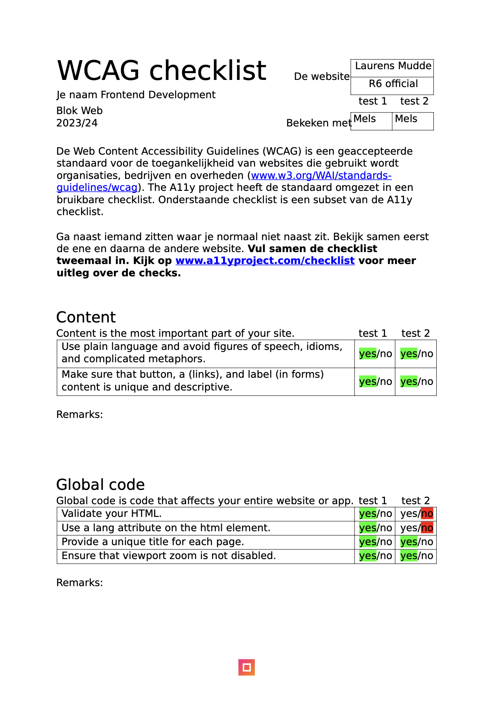
    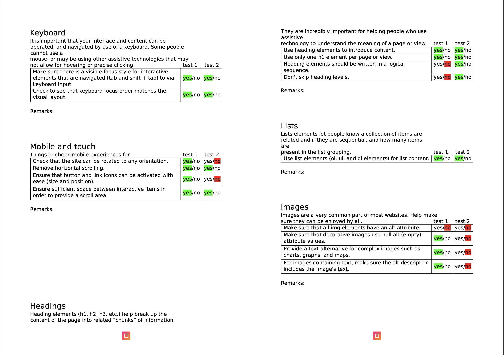
    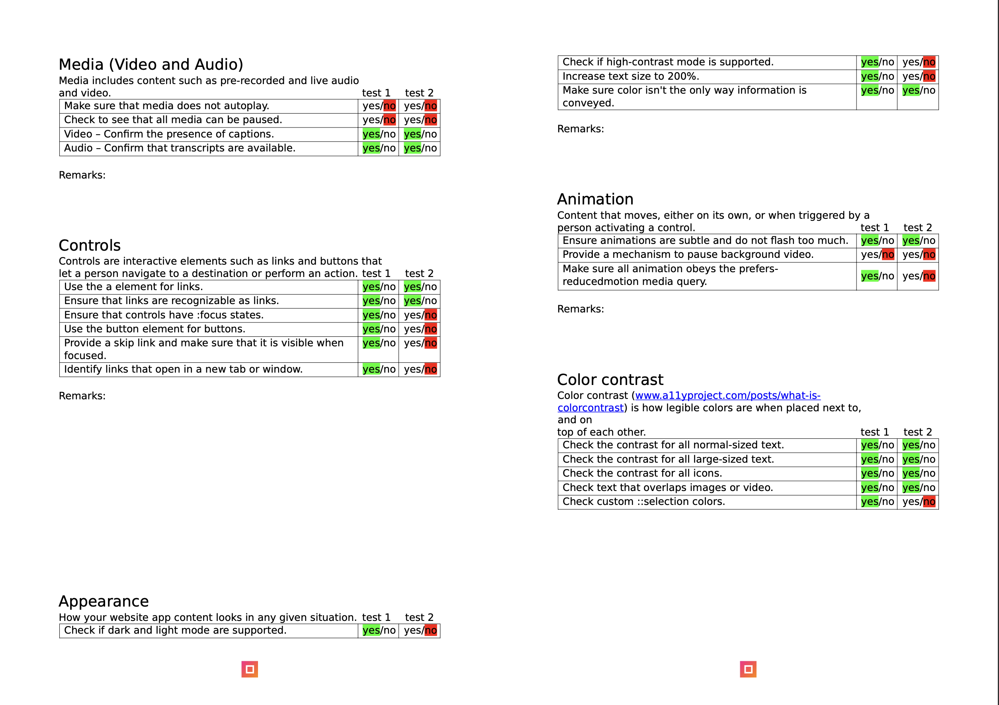

## Breakdownschets (week 1)

  
uitwerken na afloop 3e werkgroep

  ### de hele pagina: 
  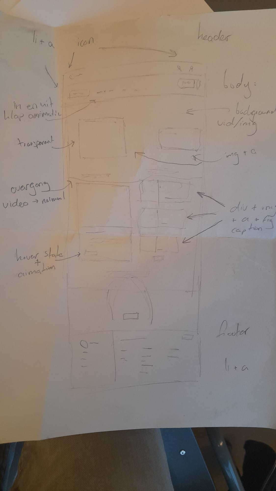

  ### dynamisch deel (bijv menu): 
  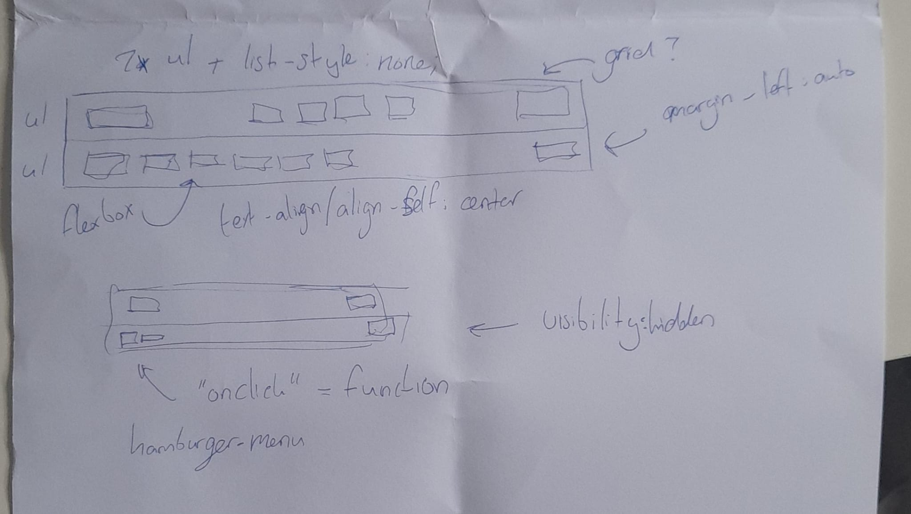

## Voortgang 1 (week 2)

  
uitwerken voor 1e voortgang

  ### Stand van zaken
 Ik heb veel progressie gemaakt met mijn HTML & CSS, het bouwen van de sites met de blokjes ging goed, alleen vermijd ik JS nogal veel, aangezien ik daar minder comfortabel mee ben

  ### Verslag van meeting
  hier na afloop snel de uitkomsten van de meeting vastleggen
  - Blijf voornamelijk doorgaan
  - Denk erom om 2 pagina's uit te werken
  - HTML validatie uitvoeren regelmatig 

## Voortgang 2 (week 3)

  
uitwerken voor 2e voortgang

  ### Stand van zaken
  hier dit ging goed & dit was lastig (neem ook screenshots op van delen van je website en code)

  ### Verslag van meeting
  hier na afloop snel de uitkomsten van de meeting vastleggen
  - CSS animatie proberen
  - Nog steeds een menu in JS
  - Meer focus op toegankelijkheid
  - Tweede pagina meer uitwerken 

## Toegankelijkheidstest 2/2 (week 4)

  
uitwerken na test in 9e werkgroep

  ### Bevindingen
  Lijst met je bevindingen die in de test naar voren kwamen (geef ook aan wat er verbeterd is):
  - Niet veel is verbetered 
  - Er zijn enkele vlakken waar ik nog zeer veel moet aan doen zoals "images"
  - Appereance and toegankelijkheid zijn nog erg laag
    
    
    

## Voortgang 3 (week 4)

  
uitwerken voor 3e voortgang

  ### Stand van zaken
  hier dit ging goed & dit was lastig (neem ook screenshots op van delen van je website en code)

  ### Verslag van meeting
  hier na afloop snel de uitkomsten van de meeting vastleggen:

  - D'r zijn heel veel mogelijkheden voor meer accesibility die ik in de gaten moet houden
  - Ik persoonijk vind dat ik nog een stuk verder moet werken, waarschijnlijk herkansen zodat ik zelf tevreden kan zijn over mijn werk
  - Html, CSS beheers ik vrij redelijk, mijn JS daarentegen heb ik vermeden en is veel ruimte voor verbetering over 

## Eindgesprek (week 5)

  
uitwerken voor eindgesprek

  ### Je uitkomst - karakteristiek screenshots:
  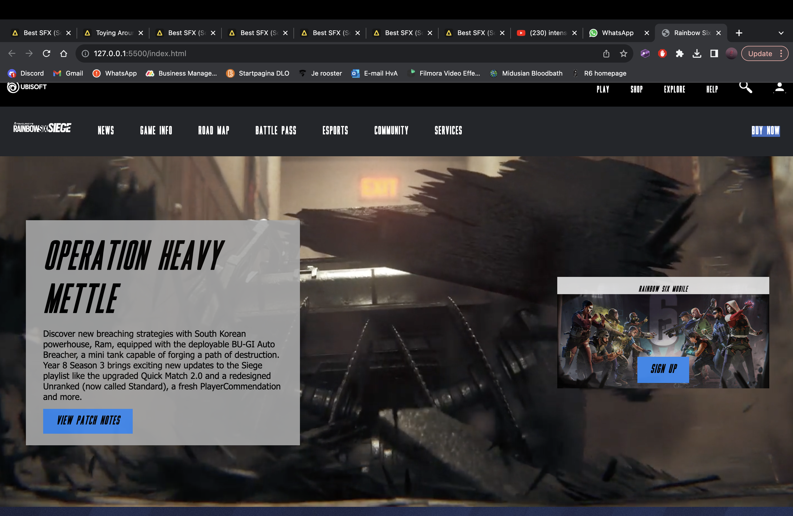
  

  ### Dit ging goed/Heb ik geleerd: 

Ik heb vrij goed met grid leren werken naar mijn mening

  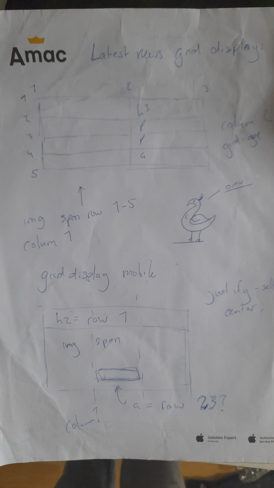
  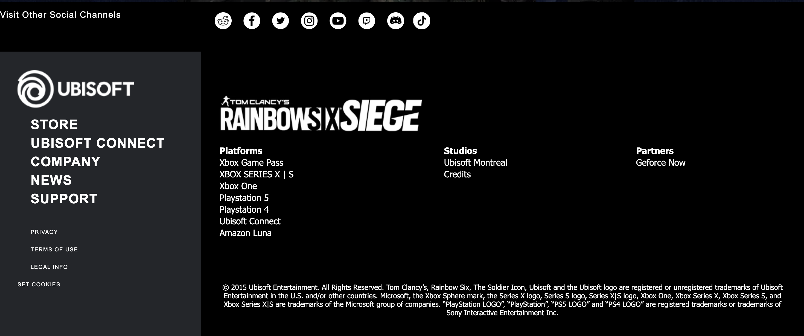

  ### Dit was lastig/Is niet gelukt:
  
 Er zijn verschillende dingen die niet gelukt zijn, hierbij een rijtje met foto's:

  <ul>
    <li>CSS animatie</li>
    <li>Hamburger menu</li>
    <li>2e pagina afmaken</li>
    <li>Volledig responsive maken</li>
</ul>

  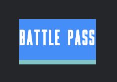
  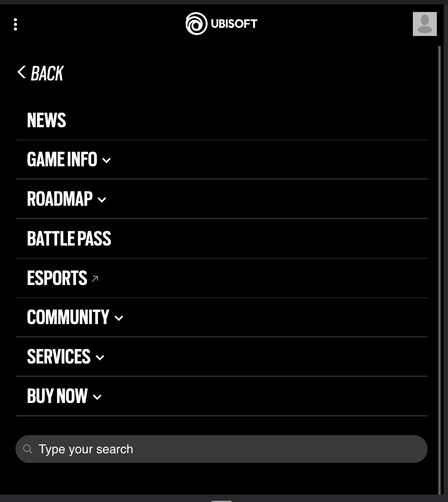
  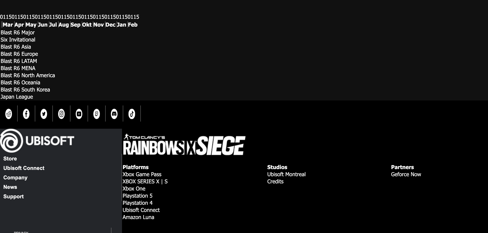
  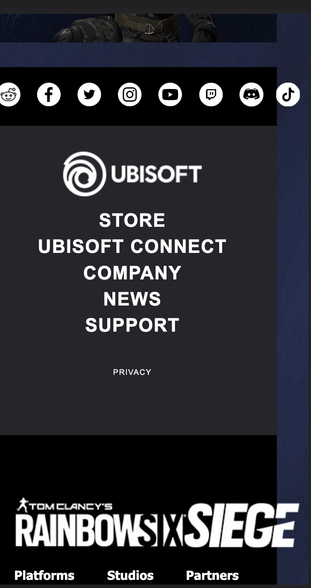

## Bronnenlijst

Bronnen waren voornamelijk mijn docen, want dat is pas een echte hulpbron... :) 
